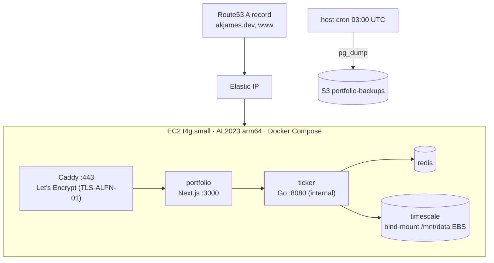
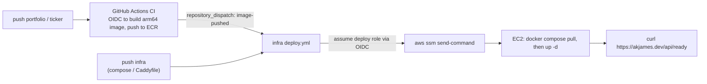

# infra

[](https://github.com/AkashJam/infra/actions/workflows/deploy.yml)

The deploy plane for [akjames.dev](https://akjames.dev) — Terraform-provisioned
AWS, one `t4g.small` running the whole stack in Docker Compose behind Caddy,
keyless CI/CD over GitHub OIDC.

This repo owns nothing but *where things run*: the EC2 box, its networking and
IAM, the Compose file that starts every service on it, TLS, and the deploy
pipeline. The two application repos —
[`portfolio`](https://github.com/AkashJam/portfolio) (Next.js) and
[`ticker`](https://github.com/AkashJam/ticker) (Go) — each just build and push
an image; they share nothing else with this repo or with each other.


<!-- TODO: capture https://akjames.dev (or a rendered topology diagram) and commit it as docs/screenshot.png -->

## Runtime topology



One box, deliberately — not a multi-service cloud topology. A personal site's
real traffic doesn't justify one, and a topology sized for scale it will never
see isn't a stronger engineering statement, just a more expensive one. Caddy
terminates TLS via the `TLS-ALPN-01` challenge on 443 only (the security group
opens nothing else — no port 80, no SSH; operator shell access is
`aws ssm start-session`). `ticker`'s API is `expose`d on the Compose network
only, never given a public route: `portfolio` is the sole public origin and
proxies reads/SSE to it server-side. TimescaleDB's data directory is
bind-mounted to a separate EBS volume at `/mnt/data`, so it survives an
instance replacement; a host crontab runs a nightly `pg_dump` off that volume
to S3.

## What Terraform provisions

Lives under [`terraform/`](terraform). Root module wires five sub-modules plus
two S3 buckets:

| Module | Provisions |
|---|---|
| [`ecr`](terraform/modules/ecr) | Two image repos (`portfolio`, `ticker`), scan-on-push, a lifecycle policy keeping the last 10 tagged images |
| [`iam`](terraform/modules/iam) | The GitHub OIDC provider; a **CI role** (assumable from either app repo, any ref — ECR push only); a **deploy role** (assumable from this repo, `main` only — `ssm:SendCommand` scoped to the tagged instance); the **EC2 instance role** (ECR pull, scoped SSM parameter reads, S3 read/write for releases/backups) |
| [`ssm`](terraform/modules/ssm) | A generated 32-char alphanumeric DB password, stored as an SSM `SecureString` — never typed or seen by a human |
| [`ec2`](terraform/modules/ec2) | The instance itself (AL2023 arm64, `t4g.small`), its security group (443 only), Elastic IP, the separate data EBS volume, and `user_data` that installs Docker/Compose and formats/mounts that volume — but starts no containers; what runs is entirely owned by `deploy.yml` |
| [`dns`](terraform/modules/dns) | Route53 `A` records for the apex and `www`, and adopts the (separately, imperatively registered) domain into state |

Two S3 buckets sit at the root: `portfolio-releases-<account>` (the deploy
workflow's staging area for `docker-compose.yml`/`Caddyfile`/`backup.sh`) and
`portfolio-backups-<account>` (nightly dumps, 30-day lifecycle expiry).
[`terraform/bootstrap/`](terraform/bootstrap) is a separate, one-time module
that creates the S3 bucket this root module uses as its remote state backend —
state locking is native S3 (`use_lockfile`), no DynamoDB table.

## Deploy flow



`portfolio` or `ticker` CI pushing a new image fires a `repository_dispatch`
here, since a bare image push doesn't touch `docker-compose.yml`. This repo's
own [`deploy.yml`](.github/workflows/deploy.yml) also runs on a push to `main`
that touches `docker-compose.yml`/`Caddyfile`, or on manual
`workflow_dispatch`. Every trigger does the same thing: assume the deploy role
over OIDC, sync `docker-compose.yml`/`Caddyfile`/`backup.sh` to the releases
bucket, resolve the running instance by its `Name` tag, then
`aws ssm send-command` on the box to fetch the DB password from SSM and run
`docker compose pull && up -d`. No static AWS credentials exist in any of the
three repos.

## First-time setup

1. Attach [`bootstrap-iam-policy.json`](bootstrap-iam-policy.json) to the IAM
   identity you'll run Terraform as.
2. `cd terraform/bootstrap && terraform init && terraform apply`, then copy
   its `state_bucket` output into `terraform/environments/prod/backend.hcl`.
3. `make init && make apply` (see targets below).
4. Register the domain out-of-band — `aws route53domains register-domain …`
   (multi-hour latency makes this a poor fit for Terraform's apply graph).
5. Set GitHub repo configuration from the root module's outputs:
   `AWS_ROLE_ARN` on `portfolio` and `ticker`; `AWS_DEPLOY_ROLE_ARN`,
   `RELEASE_BUCKET`, `AWS_REGION` on this repo.
6. Optional: once you have a [healthchecks.io](https://healthchecks.io) check,
   `aws ssm put-parameter --name /portfolio/prod/healthchecks-url --type SecureString --value <url>` —
   `ticker`'s dead-man switch stays a no-op until this exists.

## Make targets

| Target | Runs |
|---|---|
| `make init` | `terraform init -backend-config=environments/prod/backend.hcl` |
| `make fmt` | `terraform fmt -recursive` |
| `make validate` | `terraform validate` |
| `make plan` | `terraform plan -var-file=environments/prod/prod.tfvars` |
| `make apply` | `terraform apply -var-file=environments/prod/prod.tfvars` |
| `make destroy` | `terraform destroy -var-file=environments/prod/prod.tfvars` |
| `make deploy` | Manually triggers the `Deploy` workflow (`gh workflow run`) — normally this fires on its own after a push, see Deploy flow above |

There's deliberately no `make dev` here — this repo doesn't run a dev server;
its unit of work is a Terraform apply or a triggered deploy, both covered
above.

## Repo layout

```text
terraform/main.tf              root module — S3 buckets, wires the 5 sub-modules
terraform/{variables,outputs,backend}.tf
terraform/modules/             ecr, iam, ssm, ec2, dns
terraform/bootstrap/           one-time remote-state bucket (local state, run once)
terraform/environments/prod/   backend.hcl + prod.tfvars
docker-compose.yml             the 6 services that run on the box
Caddyfile                      TLS + reverse proxy
backup.sh                      nightly pg_dump → S3, run via host crontab
.github/workflows/deploy.yml   the deploy pipeline described above
```

## Operating the box

There's no SSH — shell access is `aws ssm start-session --target <instance-id>`.
Once connected, `docker compose logs -f <service>` for any of `portfolio`,
`ticker`, `redis`, `timescale`, or `caddy`. Backups land in
`s3://portfolio-backups-<account>/<timestamp>.dump`; restore with
`pg_restore` against a `docker compose exec timescale` shell.
